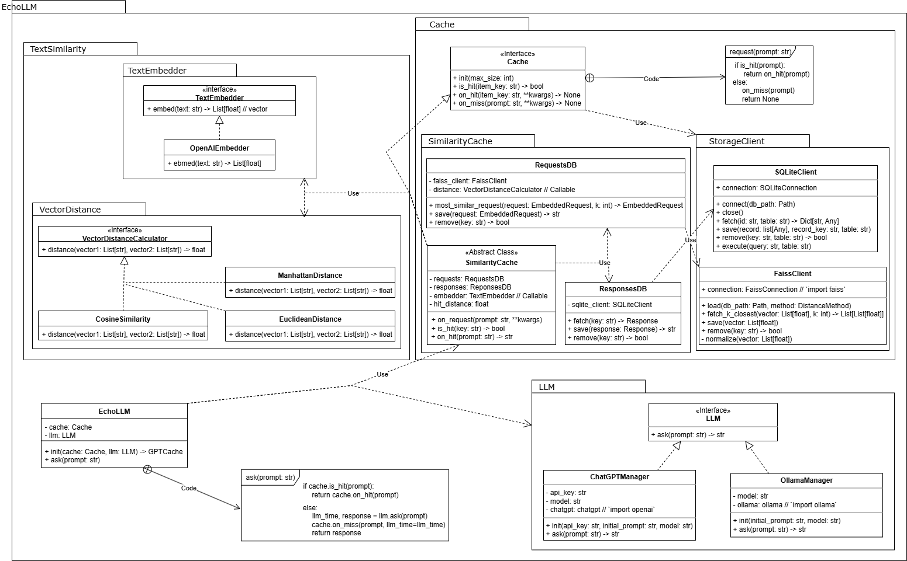

# 🌌 EchoLLM

> **EchoLLM** — a lightweight, flexible, and **beautifully simple** framework for Large Language Model (LLM)
> applications.  
> It combines **smart similarity caching**, a **plug-and-play architecture**, and a **super easy API** to make
> LLM-powered systems practical, efficient, and fun to build.

---

## 🚀 Motivation

Why another LLM framework?  
Because most frameworks either feel **bloated and rigid** or **too barebones to be useful**.  
With EchoLLM, our key contributions are:

1. **Smart Similarity Cache** — repeated or similar prompts don’t need to hit the model again. We integrate
   similarity–based caching **directly into the LLM call layer**, saving money, latency, and making caching
   *first-class* instead of an afterthought.
2. **Minimal, Simple Framework** — one of the easiest APIs for LLMs you’ll find. Import, call, get results. Done.
3. **Extreme Flexibility** — every component (cache algorithm, LLM backend, distance metric, database, etc.) is *
   *replaceable and swappable**. Want to test a custom cache policy? Just drop it in. Want to try a different LLM
   provider or similarity function? Plug it in with no friction.
4. **Super Easy API** — clear, minimal, Pythonic. No boilerplate, no YAML jungles, no “hidden magic.” You stay in
   control.

---

## ✨ Features

- 🔄 **Smart similarity cache** with pluggable policies.
- 🧩 **Composable framework** — swap LLMs, databases, distance metrics, or cache strategies effortlessly.
- 🪶 **Tiny API surface** — learn it in minutes.
- ⚡ **Fast prototyping** — go from idea → working code with almost no setup.
- 📦 **Production-ready** — caching, similarity search, modularity baked in.
- 📚 **Extensible design** — each layer is cleanly separated.

---

## 📐 Architecture

EchoLLM is built around **clean modular components**:



- **EchoLLM**: the framework's entrypoint.
- **LLM Backend**: pluggable provider (OpenAI, local models, etc.).
- **Cache Manager**: integrates *smart similarity* for reusing close-enough results.
- **Storage Client**: handles persistence (databases, file system, or pluggable storage backends).
- **Text Similarity**: pluggable text (prompt) embedders and vector distance metrics for calculating similarities
  between requests.

---

## 📦 Installation

```bash
git clone https://github.com/BlankShahar/EchoLLM.git
cd EchoLLM
python -m venv .venv && source .venv/bin/activate   # (Windows: .venv\Scripts\activate)
pip install -r requirements.txt
```

---

## ⚡ Toy Code Example


### Smart Similarity Cache

```python
from echollm import EchoLLM

echo_llm = EchoLLM(cache=SimilarityCache(...), llm=...)

# First call: misses the cache, hits the LLM
res1 = echo_llm.ask("What is an echo?")
print(res1)

# Second call: retrieved instantly from similarity cache (no LLM's API cost)
res2 = echo_llm.ask("What’s an echo?")
print(res2)
```
Check out the full example usage in [example_usage.py](./_example.py) module.
Here's an output example:
```shell
>>> ask('Write me a short script of calculator in python')
INFO:EchoLLM:Cache Miss
INFO:EchoLLM:LLM response took 10156.13ms
INFO:httpx:HTTP Request: POST http://localhost:11434/api/pull "HTTP/1.1 200 OK"
python
def calculator():
  """A simple calculator in Python."""
...
-------------
>>> ask('Make a simple calculator in python')
INFO:EchoLLM:Cache Hit
python
def calculator():
  """A simple calculator in Python."""
...
-------------
>>> ask('Hi')
INFO:EchoLLM:Cache Miss
INFO:httpx:HTTP Request: POST http://localhost:11434/api/generate "HTTP/1.1 200 OK"
INFO:EchoLLM:LLM response took 8586.60ms
Hey there! How’s your day going so far? 😊 
...
```
---

## 📂 Project Structure

```
EchoLLM/
├─ cache/                 # Cache algorithm implemenations
├─ llm/                   # LLM backends
├─ text_similarity/       # Embeddings + similarity (vector distance) logic
├─ echo_llm.py            # Main EchoLLM API
├─ _example.py            # Demo script with toy examples and usage showcase
└─ requirements.txt       # Dependencies
```

---


## 🛣️ Roadmap

- ✅ Core framework & cache
- 🚧 More sophisticated cache algorithms
- 🚧 More LLM backends (Anthropic, local models, HuggingFace)
- 🚧 Optional Redis/Postgres cache storage implementations
- 🚧 More similarity metrics out-of-the-box
- 🚧 Tracing & observability hooks

---

### 🧠 Supported Cache Policies

| Policy | Notes |
|-------|-------|
| 🔹 **LRU** | Standard least-recently-used eviction |
| 🔸 **LFU** | Tracks usage frequency to guide eviction |
| 🔹 **FIFO** | First-in-first-out queue behavior |
| 🔸 **RR** | Random replacement eviction |
| 🚀 **Adaptive Pipeline Cache** | [External implementation](https://github.com/NadavKeren/python-adaptive-pipeline-cache) – adaptive & workload-aware |

## 🤝 Contributing

PRs welcome!

- Keep things minimal and pluggable.
- Add docstrings & tests.
- Run `_example.py` before submitting.

---

## 📜 License

TBD.

---

## 💡 Inspiration

EchoLLM was inspired by prior work on caching for LLMs, such as [GPTCache](https://github.com/zilliztech/GPTCache), which demonstrated the value of avoiding redundant API calls by reusing previous responses.  

Our name **EchoLLM** comes from this very idea:  
we integrate a **caching framework as the frontend**, placed before the LLM backend.  
Whenever a cache hit occurs (e.g., for similar prompts), the cache simply **“echoes” the previous LLM response**, saving both cost and latency.  

In this way, EchoLLM emphasizes that the cache is not just a side optimization, but a **first-class design principle** in the system.
